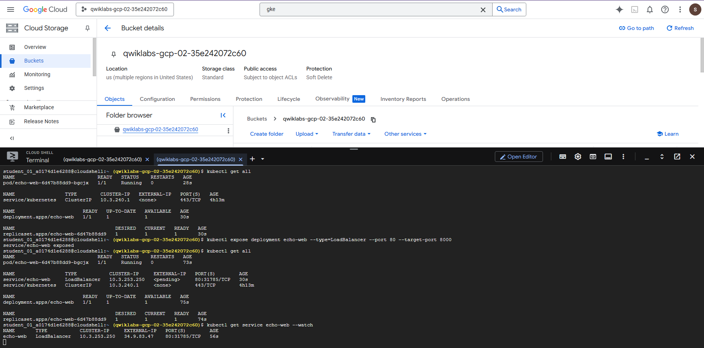
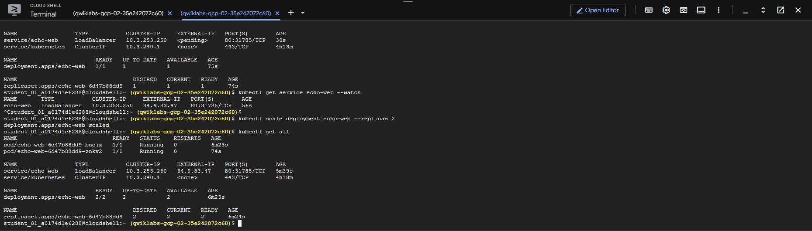

# Project Simple GKE (Google Kubernetes Engine)
Simple implementasi GKE Cluster, Deployment, Service, Scale, Replicas.

## How do i run it? to GKE

1. Build image docker
```bash
docker build -t echo-web:v2 .
```

2. Tag image to GCR(Google Container Registry)
```bash
docker tag echo-web:v2 gcr.io/$GOOGLE_CLOUD_PROJECT/echo-web:v2
```

3. Update permission Docker to upload your project 
```bash
gcloud auth configure-docker 
```

4. Push the image to GCR
```bash
docker push gcr.io/$GOOGLE_CLOUD_PROJECT/echo-web:v2 
```

5. Connect `kubectl` to cluster
```bash
gcloud container clusters get-credentials echo-cluster --zone=ZONE
```

6. Create Deployment
```bash
kubectl create deployment echo-web --image=gcr.io/$GOOGLE_CLOUD_PROJECT/echo-app:v2
```

7. Expose the service and get Public IP or External IP
```bash
kubectl expose deployment echo-web --type=LoadBalancer --port 80 --target-port 8000
```

8. Check the status of the service to obtain a public IP address
```bash
kubectl get service echo-web --watch
``` 

9. Example of Documentation from me



### note: I'm just adding a tutorial on how to run it.
The tutorial Documentation created by Mochamad Abdul Rouf

10. create `cluster` using `cloud shell`, Cluster has 2 `node` and 2 `node` using machine type `e2-standard-2`. And Customize your region zone
- example :
```bash
gcloud container clusters create echo-cluster --num-nodes=2 --machine-type=e2-standard-2 --zone=us-east1-c
```

@COPYRIGHT the code copy from Google Cloud 